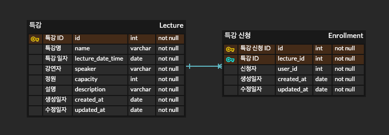

## 특강 수강신청 애플리케이션
이번 과제는 특강에 대해 수강 신청하는 애플리케이션입니다.

클린 아키텍쳐와 TDD, 동시성 제어를 활용하여 구현합니다.

### ERD

- 특강 테이블과 특강 신청 테이블 총 2개의 테이블로 구성하였습니다.
- 사용자 테이블은 오버 엔지니어링이라고 판단하여, 따로 생성하지 않았습니다.
- 특강 ID로 특강 신청을 조회하여, 해당 특강에 대한 신청 수를 조회할 수 있습니다.
- 특강 테이블에 신청 수 컬럼을 두지 않은 이유는 다음과 같습니다.
  - 특강 신청할 때마다 "특강", "특강 신청" 테이블에 대해 각각 수정/삽입이 발생하기 때문에 데이터 정합성에 문제가 발생할 여지가 있다고 판단하였습니다.
  - 현재 요구사항에서 특강 신청 정원이 30명으로 고정되어 있기 때문에, 적절한 인덱싱을 하면 성능상으로 큰 이슈는 없다고 생각했습니다.
- 특강 신청 테이블에서 특강 ID(lecture_id), 신청자(user_id) 에 유니크 제약조건을 걸어 한 명의 사용자는 하나의 특강에만 신청할 수 있도록 하였습니다.
